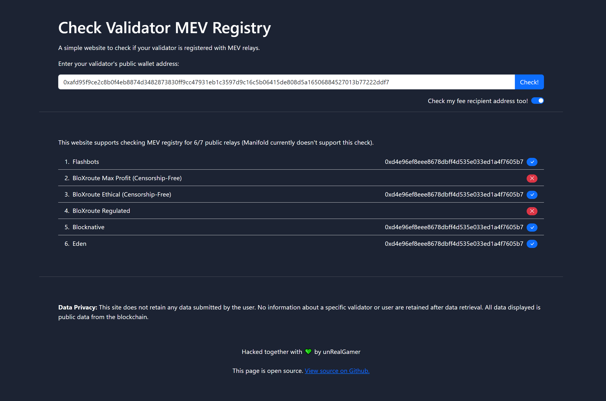

# check-mev-registry

A simple website to check if your validator is registered with MEV Boost relays.

This project supports checking MEV registery for 6/7 public MEV relays (Manifold currently doesn't support this check):

| Name | MEV Boost Relay API |
| ------ | ------ |
| Flashbots | https://boost-relay.flashbots.net |
| Bloxroute Max Profit (Censorship-Free) | https://bloxroute.max-profit.blxrbdn.com |
| Bloxroute Ethical (Censorship-Free) | https://bloxroute.ethical.blxrbdn.com |
| Bloxroute Regulated | https://bloxroute.regulated.blxrbdn.com |
| Blocknative | https://builder-relay-mainnet.blocknative.com |
| Eden | https://relay.edennetwork.io/ |
| ManifoldFinance (Censorship-Free) | Currently not supported |


## Tech Stack

**Client:** HTML5, Bootstrap CSS, Vanilla JS

**Server:** Node, Express


## Features

- Input your validator's public key to check if your validator is registered with public MEV boost relays.
- Clean and simple to use UI.


## Installation

Install this project with npm to run it locally on port 3000.

First download the git repository, then 

```bash
  cd check-mev-boost
  npm install
  node index.js
```
    
## Demo

https://check-mev-registry.unrealgamer28.repl.co/


## Screenshots




## Related

Here is one related project

- [Check MEVBoost Registration - Bash](https://github.com/pigfrown/check_mevboost_registration)

Here are some relevant articles to read

- [Reddit - MEV-Boost Relays To Avoid](https://www.reddit.com/r/ethstaker/comments/xj3bdq/mevboost_relays_to_avoid/)
- [Reddit - Best arguments to refute post-merge centralization accusations?](https://www.reddit.com/r/ethstaker/comments/xiwkd7/best_arguments_to_refute_postmerge_centralization/)
- [Github (ETHStaker) - MEV relay list for Mainnet and Goerli testnet](https://github.com/remyroy/ethstaker/blob/main/MEV-relay-list.md)
- [mevboost.org - Tracking MEV-Boost relays and block builders.](https://www.mevboost.org/)
- [Github (Awesome MEV Boost) - All awesome mev-boost related content.](https://github.com/thegostep/awesome-mev-boost)


## FAQ

#### 1. What does it mean to be registered with a relay?

- If you're registered with a MEV Boost relay, it means that particular relay will provide you with blocks that give highest Maximum Extractable Value (MEV) fees based on it's own rules (of censoring some transactions from the block or not).
- MEV Boost registration is almost immediate once you configure and setup mev-boost package.
- mev-boost package will also regularly resend validator registrations, in case a relay or builder comes online just after a previous registration was sent out and missed that.

#### 2. What happens if my validator doesn't register with a relay? Or the relay fails to provide a block?

- If your validator isn't able to get a block from a relay, then your validator will produce it's own block and submit that.
- There's almost no downside to using MEV Boost to maximize your profit, besides from ethereum's centralization risks.
- "But if mev-boost package and your Consensus Layer (CL) client sign the header of the highest return block but the relay fails to provide that block, then you will miss your proposal." ~ Nabsku (Dappnode Moderator)

#### 3. What do you mean by "Censorship-Free" relays? What about the other relays that do censor?

- "Censorship-Free" relays have publicily announced that they will not be censoring any transaction in the blocks they produce. Meaning they will not follow the OFAC sanctioned list of wallet addresses.
- ie Wallet addresses that were involved with Tornado Cash were put on the OFAC sanction list.
- The relays choosing to follow the OFAC list will not build blocks containing transactions that have touched these wallet addresses. They do this because they're afraid of getting in trouble with US sanction laws.
- "Ethereum is a neutral settlement layer, much like an ISP, and does not and should not care about the content/transactions being processed by the network. Censorship is an unnecessary, reactive, harmful step to take, and the Ethereum staking community should vigorously reject such relays and not give them any blockspace until they grow a backbone and stop censoring." ~ /u/interweaver

Read more here: https://www.reddit.com/r/ethstaker/comments/xj3bdq/mevboost_relays_to_avoid/

More over here: https://www.reddit.com/r/ethstaker/comments/xiwkd7/best_arguments_to_refute_postmerge_centralization/

#### 4. Do you store any logs? IP's, validator's public keys, etc?

- No, I don't.
- You're more than welcome to check the source code and verify it yourself. Then build it locally to use it.

#### 5. I have a question, an issue, or a suggestion that's not listed here?

- Please open an issue with the relevant details. Thank you!
## License

[GNU GPLv3](https://choosealicense.com/licenses/gpl-3.0/)
